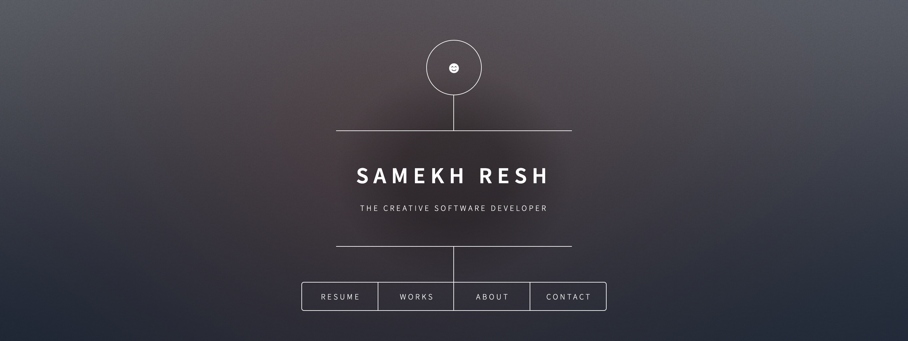

# Portfolio
Hi Everyone, this is my portfolio for my website. 

<b>link to project</b> https://samekh-portfolio.netlify.app/

### How It’s Made

<b>Langs used</b>
Html CSS SASS

So i have to say flat out, this html is not mine. I did, however, choose this because it was an aesthetic I want to create. I've been studying this portfolio for a couple days. I hope to one day create a portfolio that will allow you to click on certain categories with some nice effects and float away. 

### optimizations

### Lessons Learned
